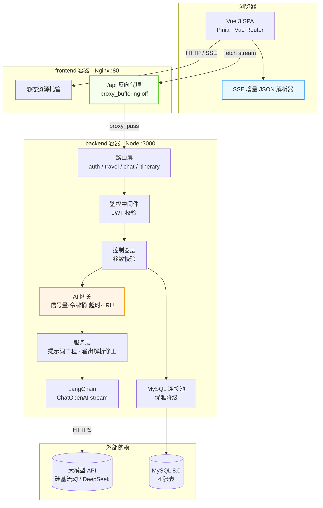

<div align="center">

# 远行者 · AI 智能旅游助手

**基于 LLM 的行程规划与多轮对话系统 —— 从提示词工程到流式传输的完整工程实践**

`Vue 3` `Vite 6` `Element Plus` · `Express` `LangChain` `MySQL 8` · `SSE 流式` `Docker`

</div>

---

## 目录

- [一、项目简介](#一项目简介)
- [二、核心亮点](#二核心亮点)
- [三、功能一览](#三功能一览)
- [四、技术选型](#四技术选型)
- [五、系统架构](#五系统架构)
- [六、关键设计详解](#六关键设计详解)
- [七、数据库设计](#七数据库设计)
- [八、快速开始](#八快速开始)
- [九、API 接口文档](#九api-接口文档)
- [十、项目结构](#十项目结构)
- [十一、工程实践](#十一工程实践)

---

## 一、项目简介

一个面向 C 端的 AI 旅游助手，用户输入「目的地 + 预算 + 天数 + 偏好」，系统调用大语言模型**流式**生成逐日行程（含早/中/晚三段安排、预算拆解、实用贴士），并在前端实现**边生成边渲染**的渐进式呈现效果。同时提供 AI 多轮对话、行程持久化、收藏管理、旅行足迹数据可视化与行程导出能力。

项目的重心不在「调通一个模型 API」，而在于**把不可控的 LLM 调用改造成一个可控、可观测、可降级的后端服务**，并解决流式 JSON 的渐进式渲染难题。

> **体验提示**：未配置 API Key 时后端自动进入 **Mock 模式**，用预置数据模拟完整流式输出，**无需任何密钥即可跑通全部业务流程**。

---

## 二、核心亮点

### 1. 自研 AI 网关：把「慢、贵、不稳定」的模型调用关进笼子

大模型接口有三个致命特点：慢、贵、不稳定。直接在业务代码里裸调模型，会导致请求堆积拖垮服务、模型卡住时连接永不释放、被脚本刷接口烧掉大量 token、相同问题反复付费调用。

`backend/src/services/aiGateway.js` 用**四件套**统一解决，并对外暴露运行时指标：

| 机制 | 实现 | 解决什么问题 |
| :--- | :--- | :--- |
| **并发控制** | `Semaphore` 信号量 + `tryAcquire` 快速失败 | 防止请求无限堆积打满服务，超出并发直接返回 503 而非让调用方干等 |
| **按用户限流** | `TokenBucket` 令牌桶（容量 10，约 6 秒恢复 1 个额度） | 单用户高频刷接口，返回 429 并携带 `retryAfterSec` 提示重试时间 |
| **超时熔断** | 总时长上限 + **单数据块停滞检测**双保险 | 区分「生成慢」和「已卡死」，卡住即中断并释放模型连接 |
| **结果缓存** | `LRUCache`（100 条 / 10 分钟 TTL） | 相同参数直接命中，**命中缓存时仍以流式分片吐出**，前端体验完全一致 |

关键细节：无论正常结束还是异常中断，都在 `finally` 中调用 `iterator.return()` **关闭底层迭代器**，避免模型连接泄漏。

### 2. SSE 流式传输：全链路为「打字机效果」让路

流式输出的最大敌人是**中间层的缓冲**。本项目在三个层面逐一击破：

- **后端**：`utils/sse.js` 设置 `X-Accel-Buffering: no` 关闭 Nginx 缓冲，15 秒心跳保活，并**监听 `response` 的 `close` 事件**（而非 `request` —— 请求体读完后 `request` 会立即触发 `close`，会导致刚推第一帧就被误判为客户端断开）
- **网关层**：Nginx 配置 `proxy_buffering off` + `gzip off` + 读超时放宽至 300 秒
- **前端**：`EventSource` 只支持 GET 且无法带 Token，Axios 不支持读流式响应体 —— 因此基于 **Fetch API + `ReadableStream`** 手写 SSE 协议解析，并通过 `AbortController` 实现随时中断

客户端断开后，后端**立即停止读取模型流**，不再为已离开的用户烧 token。

### 3. 增量 JSON 解析器：让行程卡片「逐张浮现」

这是本项目最具挑战性的部分。模型流式输出的是一段**尚未闭合的 JSON**，要实时渲染就必须从中提取「已经完整」的片段。

`front/src/utils/sse.js` 中的 `extractPartialItinerary` 实现了一个**带状态机的不完整 JSON 扫描器**：

- 逐字符扫描，用 `depth` 追踪对象嵌套层级
- 用 `inStr` / `esc` 标记区分**字符串内部的括号与转义字符**（否则 JSON 文本里出现 `"price": "{100}"` 这类内容就会误判层级）
- 每识别出一个完整的顶层对象就立即 `JSON.parse` 并推入渲染列表
- 对象不完整（如字符串被截断）时跳过等待下一批数据

效果：用户看到的不是「转圈 → 突然全部出现」，而是**总览先出 → 第 1 天卡片浮现 → 第 2 天卡片浮现 → 预算图表填充**的渐进过程。

### 4. 模型输出的容错与自愈

LLM 返回结构化数据是出了名的不靠谱。服务层做了三重防御：

- **解析容错**：`parseItineraryJSON` 依次尝试 ` ```json ` 包裹、无标注代码块、裸 JSON 三种形态
- **结构兜底**：`normalizeItinerary` 补齐缺失的天数与时段字段，保证前端渲染绝不因缺字段而崩溃
- **预算自洽修正**：模型给出的预算分项加总几乎总与用户预算不符 —— 按比例缩放各项使其**严格等于**用户预算，并置 `budgetMatched` 标志位告知前端；模型完全没给预算时按经验比例（住宿 35% / 餐饮 25% / 交通 15% / 门票 15%）分摊

### 5. 优雅降级：数据库挂了，AI 功能照常可用

连接池采用惰性初始化 + 探活，连接失败时**不阻断服务启动**，仅数据库相关功能不可用，AI 对话与行程生成完全正常。这让服务在依赖故障时保住核心体验，而非整体雪崩。

---

## 三、功能一览

| 模块 | 功能 |
| :--- | :--- |
| **行程规划** | 城市 / 预算 / 天数 / 出发日期 / 同行人 / 节奏 / 兴趣主题 / 补充要求 → 流式生成逐日行程 |
| **渐进渲染** | 流式 JSON 增量解析，行程卡片逐张浮现，实时展示生成进度 |
| **单景点重生成** | 对某个时段点「换一个」，AI 推荐类型错开的替代去处，并**自动避开行程中已有的其他地点** |
| **AI 多轮对话** | 旅游问答，携带最近 20 条历史上下文；未登录可体验，登录后会话持久化 |
| **会话管理** | 多会话列表、历史消息回溯、级联删除 |
| **行程管理** | 保存、列表分页、关键词/城市筛选、排序、收藏、删除 |
| **旅行足迹** | ECharts 可视化：城市分布、预算分布、月度趋势等统计 |
| **用户体系** | 注册 / 登录 / 资料修改 / 密码修改；旅行偏好档案用于规划表单**智能预填** |
| **导出分享** | 行程详情导出 PDF（html2canvas + jsPDF） |
| **主题切换** | 亮色 / 暗色主题，记忆用户选择 |

---

## 四、技术选型

### 前端

| 技术 | 版本 | 选型理由 |
| :--- | :--- | :--- |
| Vue 3 | 3.5 | Composition API 更适合组织流式渲染这类有状态逻辑 |
| Vite 6 | 6.0 | 冷启动与 HMR 快；路由级代码分割，首屏只加载必需 chunk |
| Pinia | 2.3 | 轻量状态管理；`plan` store 在「规划页 → 详情页」间传递行程数据 |
| Element Plus | 2.9 | 组件完备，中文场景成熟，支持暗色主题变量 |
| ECharts | 5.5 | 旅行足迹统计可视化 |
| marked + DOMPurify | - | 渲染模型输出的 Markdown，**DOMPurify 净化防止 XSS** —— AI 生成内容属于不可信输入，必须净化 |
| html2canvas + jsPDF | - | 行程导出为 PDF |

### 后端

| 技术 | 版本 | 选型理由 |
| :--- | :--- | :--- |
| Express | 4.19 | 中间件生态成熟，路由与错误处理分层清晰 |
| LangChain | 0.3 | 统一不同厂商的 OpenAI 兼容协议，切换模型不改业务代码 |
| mysql2 | 3.11 | 支持 Promise 与连接池，预处理语句防 SQL 注入 |
| jsonwebtoken + bcryptjs | - | JWT 无状态鉴权；bcrypt 加盐哈希存储密码 |
| SSE | 原生实现 | 相比 WebSocket，流式文本输出是**单向**的，SSE 更轻量且自带断线重连语义 |

### 运维

| 技术 | 用途 |
| :--- | :--- |
| Docker 多阶段构建 | 前后端镜像均分离构建与运行阶段，最终镜像不含 `node_modules` 与 npm 缓存 |
| docker-compose | 一键编排 `mysql` + `backend` + `frontend`，健康检查驱动启动顺序 |
| Nginx | 静态资源托管 + `/api` 反向代理 + SSE 专项调优 |
| dumb-init | 作为 PID 1 转发信号，让 Node 的优雅停机逻辑真正生效 |

---

## 五、系统架构



**请求链路**（以生成行程为例）：

```
浏览器 fetch(POST /api/travel/recommend)
   → Nginx 关闭缓冲，透传流式响应
   → authOptional 中间件解析 JWT（未登录放行，改按 IP 限流）
   → 控制器校验参数
   → AI 网关：限流 → 并发控制 → 查缓存 → 调模型（带超时）→ 写缓存
   → LangChain 流式产出 token
   → SSE 逐帧推送 chunk 事件
   → 前端增量解析器提取完整片段 → 卡片逐张浮现
   → 模型输出完毕 → 后端解析校验修正 → SSE done 事件携带完整行程
```

---

## 六、关键设计详解

### 6.1 AI 网关的完整调用链

```
guardedStream()
  ├─ 1. 令牌桶限流（按 userId 或 IP）        → 拒绝则抛 429，带 retryAfterSec
  ├─ 2. 信号量 tryAcquire（快速失败）         → 拒绝则抛 503
  ├─ 3. 查 LRU 缓存                          → 命中则分片模拟流式吐出（保持体验一致）
  ├─ 4. 调用模型（双重超时保护）
  │     ├─ 总时长上限 120s
  │     └─ 单数据块停滞 30s（防卡死）
  └─ 5. 写入缓存 + 更新指标
  
  无论成功失败：finally 中释放信号量、关闭迭代器
```

运行时指标通过 `GET /api/health` 暴露：总请求数、成功率、缓存命中数、限流次数、超时次数、并发拒绝数、平均延迟、活跃请求数、运行时长。

### 6.2 统一鉴权策略：`authRequired` 与 `authOptional`

项目没有粗暴地「所有接口都要登录」，而是按接口性质分级：

- `authRequired`：行程 CRUD、会话管理、个人资料 —— 涉及用户私有数据，必须登录
- `authOptional`：行程生成、AI 对话 —— **登录与不登录都能用**

这样既保证数据资产安全，又让新用户零门槛体验核心功能。登录后按 `userId` 限流，未登录按 `IP` 限流，限流策略保持一致性。

### 6.3 提示词工程

行程生成的提示词不是一句「帮我规划」，而是把结构化输入逐条注入：

- 明确**硬性约束**：`budgetBreakdown` 各项之和必须等于 `totalBudget`，要求模型自行核算
- 注入**时间与人群信号**：出发日期（结合当季天气、节假日人流）、同行人（符合该人群体力与兴趣）、行程节奏、兴趣主题
- 约束**输出契约**：只输出 JSON、不使用 Markdown 代码块标记、金额字段为纯数字

「换一个景点」的提示词额外做了两件事：要求与当前安排**类型错开**（当前是博物馆就换户外），并**显式列出行程中其他时段已安排的地点**要求避开 —— 避免「换了一个差不多的」或换出重复地点。

### 6.4 数据库：JSON 灵活性与查询性能的平衡

行程正文（每日安排、预算明细）结构复杂且会随业务演进，存为 **JSON 列**避免频繁 `ALTER TABLE`；而 `city` / `budget` / `days` / `user_id` 这类高频检索与统计字段**提升为独立列并建索引**，兼顾灵活性与查询性能。

---

## 七、数据库设计

四张表，依赖关系清晰，外键均配置 `ON DELETE CASCADE`。

| 表名 | 说明 | 设计要点 |
| :--- | :--- | :--- |
| `users` | 用户表 | `password` bcrypt 加盐哈希；`preferences` JSON 列存旅行偏好档案 |
| `itineraries` | 行程表 | `content` JSON 存正文；`idx_user_created` 支持按时间倒序分页；`idx_user_favorite` 支持收藏筛选 |
| `chat_sessions` | 会话表 | 主键用 **UUID** 而非自增 ID —— 自增 ID 会暴露平台业务量，且 UUID 便于前端在发起对话前就生成 ID 实现乐观跳转 |
| `chat_messages` | 消息表 | `idx_session_created` 按会话拉取历史；外键级联删除 |

```sql
-- 行程表核心结构（完整脚本见 backend/sql/schema.sql）
CREATE TABLE itineraries (
  id          INT UNSIGNED     NOT NULL AUTO_INCREMENT,
  user_id     INT UNSIGNED     NOT NULL,
  title       VARCHAR(100)     NOT NULL,
  city        VARCHAR(50)      NOT NULL,
  budget      INT UNSIGNED     NOT NULL DEFAULT 0,
  days        TINYINT UNSIGNED NOT NULL DEFAULT 1,
  content     JSON,
  is_favorite TINYINT(1)       NOT NULL DEFAULT 0,
  created_at  TIMESTAMP        NOT NULL DEFAULT CURRENT_TIMESTAMP,
  updated_at  TIMESTAMP        NOT NULL DEFAULT CURRENT_TIMESTAMP ON UPDATE CURRENT_TIMESTAMP,
  PRIMARY KEY (id),
  KEY idx_user_created (user_id, created_at),
  KEY idx_user_favorite (user_id, is_favorite),
  KEY idx_city (city),
  CONSTRAINT fk_itineraries_user FOREIGN KEY (user_id)
    REFERENCES users (id) ON DELETE CASCADE
) ENGINE=InnoDB DEFAULT CHARSET=utf8mb4 COLLATE=utf8mb4_unicode_ci;
```

> ⚠️ **注意**：`schema.sql` 开头会 `DROP TABLE` 后重建，**仅用于全新环境初始化**。已有数据的环境请使用 `sql/migrations/` 下的增量脚本。

---

## 八、快速开始

### 环境要求

- Node.js >= 18
- MySQL >= 5.7（本地开发用；Docker 方式已内置，**无需本地安装**）
- Docker Desktop（容器化部署用）

### 方式一：Docker 一键启动（推荐）

```bash
# 1. 复制环境变量模板
cp .env.example .env

# 2. 构建并启动（首次会自动拉取镜像、安装依赖、构建前端、建库建表）
docker compose up -d --build

# 3. 查看服务状态，等待三个服务均为 healthy
docker compose ps

# 4. 打开浏览器访问
#    http://localhost
```

MySQL 数据卷首次启动时会自动执行 `backend/sql/schema.sql` 建库建表，**无需手动导入**。

常用运维命令：

```bash
docker compose logs -f backend    # 查看后端日志
docker compose restart backend    # 重启单个服务
docker compose down               # 停止并移除容器（数据卷保留）
docker compose down -v            # 停止并清除数据卷（会清空数据库）
docker compose up -d --build      # 改代码后重新构建
```

| 服务 | 容器名 | 默认端口 | 说明 |
| :--- | :--- | :--- | :--- |
| frontend | `travel-frontend` | `80` | 应用入口 |
| backend | `travel-backend` | 不暴露 | 经 Nginx 代理，需直连调试见下 |
| mysql | `travel-mysql` | `3307` | 默认 3307 避开本机已装的 MySQL |

> 需要直连后端调试时，取消 `docker-compose.yml` 中 `backend.ports` 的三行注释即可。

### 方式二：本地开发

```bash
# ---------- 后端 ----------
cd backend
npm install
cp .env.example .env          # 按需修改数据库口令等
npm run init-db               # 建库建表（读取 sql/schema.sql）
npm run dev                   # 启动于 http://localhost:3000

# ---------- 前端（新开终端）----------
cd front
npm install
npm run dev                   # 启动于 http://localhost:5173
```

Vite 已配置 `/api` 代理到 `localhost:3000`，前端代码统一写相对路径即可。

### 配置大模型（可选）

编辑 `.env`（Docker 方式改根目录 `.env`，本地开发改 `backend/.env`）：

```bash
LLM_PROVIDER=siliconflow
LLM_API_KEY=sk-xxxxxxxxxxxxxxxx
LLM_MODEL=Qwen/Qwen2.5-72B-Instruct
```

内置两家 OpenAI 兼容厂商预设，切换只需改 `LLM_PROVIDER`：

| Provider | 默认模型 | Base URL |
| :--- | :--- | :--- |
| `siliconflow` | `Qwen/Qwen2.5-72B-Instruct` | `https://api.siliconflow.cn/v1` |
| `deepseek` | `deepseek-chat` | `https://api.deepseek.com/v1` |

**留空 `LLM_API_KEY` 即进入 Mock 模式**，用预置数据模拟流式输出，前端代码零改动，适合演示与联调。

---

## 九、API 接口文档

统一前缀 `/api`，统一响应格式 `{ code, message, data }`。

### 健康检查

| 方法 | 路径 | 说明 |
| :--- | :--- | :--- |
| GET | `/api/health` | 服务状态、模型配置、数据库连通性、AI 网关运行时指标 |

### 鉴权 `/api/auth`

| 方法 | 路径 | 鉴权 | 说明 |
| :--- | :--- | :--- | :--- |
| POST | `/auth/register` | - | 注册 |
| POST | `/auth/login` | - | 登录 |
| GET | `/auth/profile` | ✅ | 获取用户资料 |
| PUT | `/auth/profile` | ✅ | 更新资料 |
| PUT | `/auth/preferences` | ✅ | 更新旅行偏好档案 |
| POST | `/auth/change-password` | ✅ | 修改密码 |

### 行程规划 `/api/travel`

| 方法 | 路径 | 鉴权 | 说明 |
| :--- | :--- | :--- | :--- |
| POST | `/travel/recommend` | 可选 | **SSE 流式**生成行程 |
| POST | `/travel/swap` | 可选 | 单个时段重生成（换一个景点） |
| GET | `/travel/meta` | - | 热门城市与快捷提问 |

### AI 对话 `/api/chat`

| 方法 | 路径 | 鉴权 | 说明 |
| :--- | :--- | :--- | :--- |
| POST | `/chat/completions` | 可选 | **SSE 流式**旅游问答 |
| GET | `/chat/sessions` | ✅ | 会话列表 |
| POST | `/chat/sessions` | ✅ | 新建会话 |
| GET | `/chat/sessions/:id/messages` | ✅ | 历史消息 |
| DELETE | `/chat/sessions/:id` | ✅ | 删除会话（级联删除消息） |
| GET | `/chat/quick-questions` | - | 快捷提问 |

### 行程管理 `/api/itinerary`（均需登录）

| 方法 | 路径 | 说明 |
| :--- | :--- | :--- |
| POST | `/itinerary` | 保存行程 |
| GET | `/itinerary` | 列表（分页、关键词/城市筛选、排序） |
| GET | `/itinerary/stats` | 旅行足迹统计 |
| GET | `/itinerary/:id` | 行程详情 |
| PUT | `/itinerary/:id` | 更新行程 |
| DELETE | `/itinerary/:id` | 删除行程 |
| POST | `/itinerary/:id/favorite` | 切换收藏 |

### SSE 事件协议

流式接口返回 `text/event-stream`，帧格式：

```
event: start
data: {"message":"正在生成旅游规划...","traceId":"..."}

event: chunk
data: {"content":"模型输出的一小段文本"}

event: done
data: {"itinerary":{...完整行程对象...}}

event: error
data: {"message":"错误描述"}
```

---

## 十、项目结构

```
travel/
├── docker-compose.yml          # 三服务编排：mysql + backend + frontend
├── .env.example                # 部署环境变量模板（.env 已被 git 忽略）
├── .gitignore                  # 忽略 node_modules / dist / .env / IDE 配置
├── .gitattributes              # 统一 LF 换行符，避免跨平台 diff 爆红
│
├── backend/                    # 后端服务
│   ├── Dockerfile              # 多阶段构建 + 非 root + dumb-init + 健康检查
│   ├── .dockerignore
│   ├── sql/
│   │   ├── schema.sql          # 建库建表（全新环境）
│   │   └── migrations/         # 增量迁移脚本
│   └── src/
│       ├── index.js            # 入口：中间件装配 + 优雅停机
│       ├── config/             # 配置中心 & 数据库连接池（优雅降级）
│       ├── routes/             # 路由层
│       ├── controllers/        # 控制器：参数校验 + 流程编排
│       ├── services/
│       │   ├── aiGateway.js    # ★ AI 网关：信号量/令牌桶/超时/LRU
│       │   ├── llm.js          # LangChain 封装 + Mock 模式
│       │   ├── travelService.js# 行程提示词 + 输出解析与修正
│       │   └── chatService.js  # 对话提示词 + 意图识别
│       ├── middleware/         # JWT 鉴权 + 全局错误处理
│       ├── utils/              # SSE 工具 / JWT / 统一响应 / 异步包装
│       └── scripts/initDb.js   # 建库脚本
│
├── front/                      # 前端应用
│   ├── Dockerfile              # 构建阶段(Node) + 运行阶段(Nginx)
│   ├── nginx.conf              # SPA 回退 + /api 代理 + SSE 专项调优
│   ├── index.html
│   └── src/
│       ├── views/              # 页面：规划/详情/对话/我的行程/足迹/个人中心
│       ├── components/         # 预算图表 / 聊天气泡 / 景点卡片
│       ├── stores/             # Pinia：user / plan / chat / app
│       ├── api/                # 接口封装
│       ├── utils/
│       │   ├── sse.js          # ★ SSE 读取 + 增量 JSON 解析器
│       │   └── request.js      # Axios 封装（Token 注入 / 401 处理）
│       ├── router/             # 路由 + 登录守卫
│       └── constants/          # 城市与主题常量
│
└── docs/                       # 设计文档
```

---

## 十一、工程实践

**优雅停机**：收到 `SIGTERM` 后先停止接收新连接、等待存量请求处理完毕，再关闭数据库连接池；10 秒兜底强制退出防止服务僵死。配合 Docker 的 `dumb-init` 作为 PID 1，信号才能正确传达给 Node 进程。

**分层错误处理**：全局错误中间件识别 `ApiError`（业务错误，用预设状态码）、`GatewayError`（限流 429 / 并发拒绝 503 / 超时 504，透传真实状态码让前端给出对应提示）、MySQL 唯一键冲突（409）；未预期错误打印堆栈但**不向前端暴露内部信息**。

**安全**：
- 密码 bcrypt 加盐哈希，JWT 无状态鉴权
- SQL 全部使用预处理语句占位符
- AI 生成的 Markdown 经 DOMPurify 净化后渲染，防 XSS
- 容器以非 root 用户运行；后端不暴露主机端口，仅由 Nginx 代理
- `.env` 已被 `.gitignore` 严格忽略，仓库内只有 `.env.example` 模板

**可观测性**：`GET /api/health` 聚合模型配置、数据库连通性与 AI 网关全量运行时指标；生产环境 Morgan 只记录 4xx/5xx 异常请求，避免日志噪音。

**Mock 模式**：未配置 API Key 时自动启用，预置数据覆盖行程生成、单景点替换、AI 对话三条链路，保证无密钥也能完整演示，且不污染任何业务代码分支。


## License

[MIT](./LICENSE)

---

<div align="center">

如果这个项目对你有帮助，欢迎 Star ⭐

</div>
